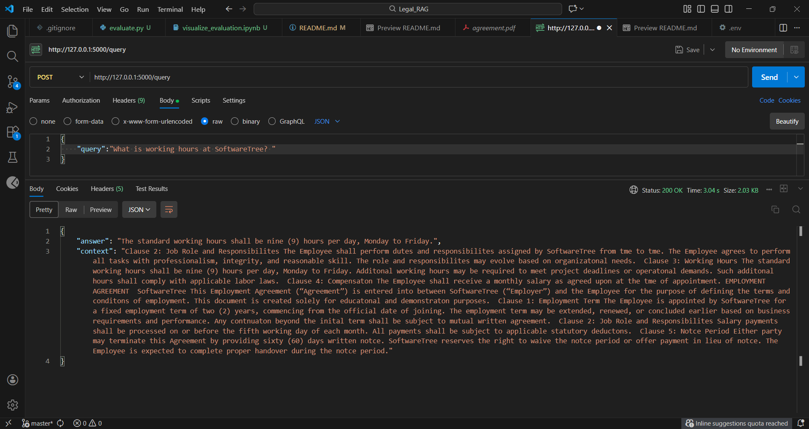

# RAG for Employee agreements

This is a flask based RAG application for employees agreement. This is built using gemini-2.5-flash, LangChain, Langfuse and Pinecone. This app answers employees queries from the comapny's agreement pdf.

## Feature:

1. /ingest POST: To upload, split data into chunks of 400, and upload on Pincone's index.
2. /query POST: To ask query and get relevant answer from the pdf

## Technologies used:

1. Flask
2. LangChain
3. Langfuse
4. Gemini
5. Pinecone

### API KEYS:

1. GEMINI API KEY
2. LANGFUSE_PUBLIC_KEY
3. LANGFUSE_SECRET_KEY
4. PINECONE_API_KEY

### Sample Output:

